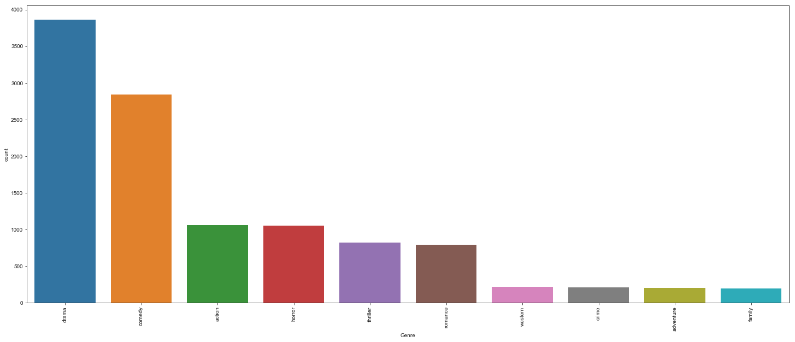
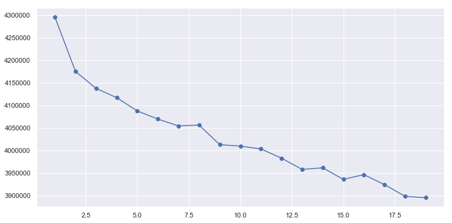
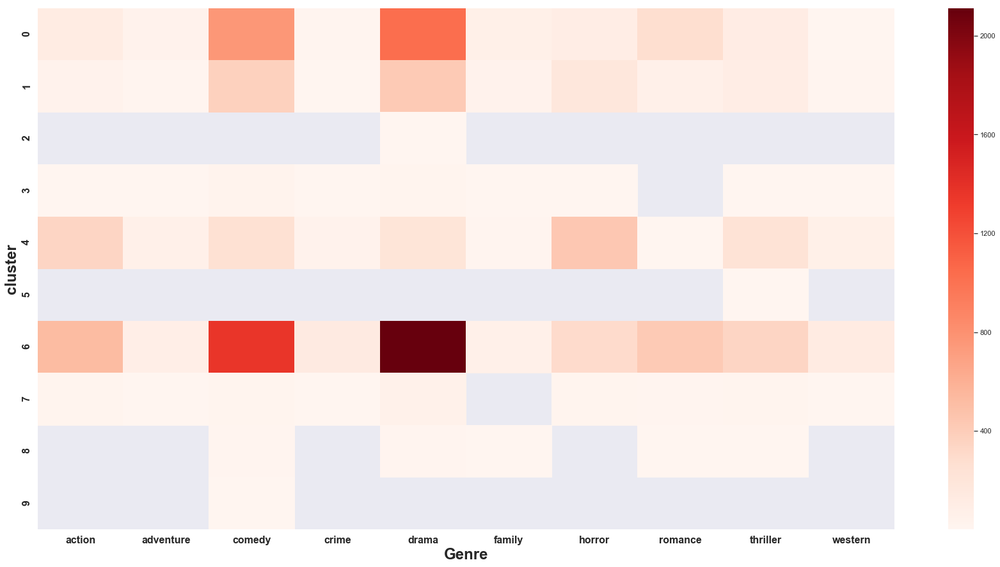
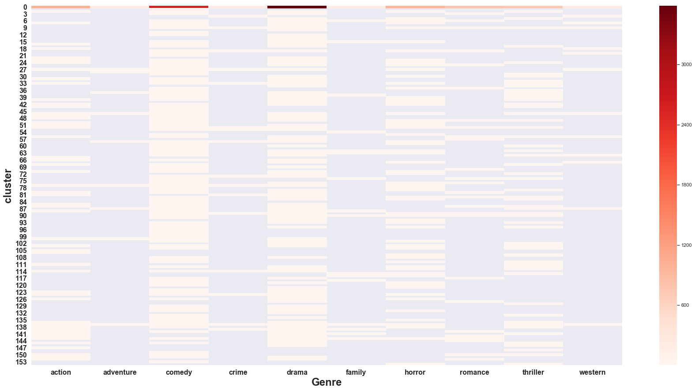
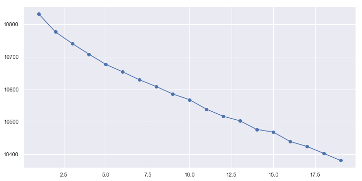
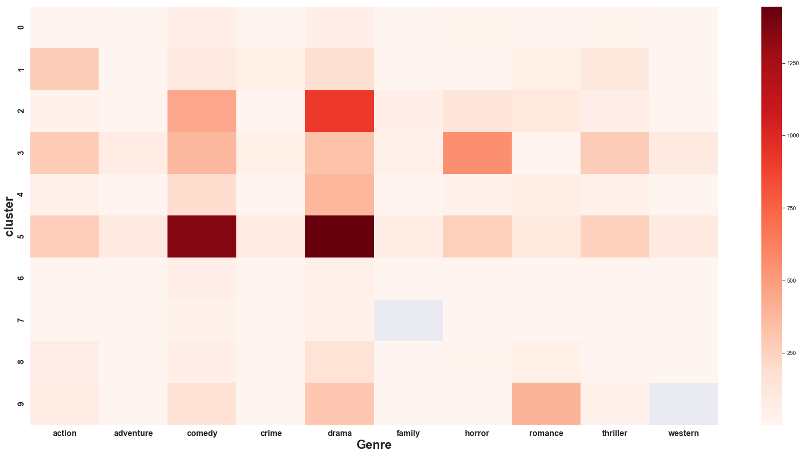

```python
%matplotlib inline
import numpy as np
import pandas as pd
import scipy
import sklearn
import spacy
import matplotlib.pyplot as plt
import seaborn as sns
import re 
import string
import nltk
nltk.download('wordnet')
from nltk.corpus import gutenberg, stopwords
from nltk.stem.snowball import SnowballStemmer
from sklearn.feature_extraction.text import CountVectorizer
from nltk.tokenize import RegexpTokenizer
from collections import Counter
```

    [nltk_data] Downloading package wordnet to C:\nltk_data...
    [nltk_data]   Package wordnet is already up-to-date!
    

## NLP Unsupervised: Wikipedia Movie Plot Summaries ##

For me unsupervised capstone, I decided to see if I could parse out language from the plot summaries of movies on wikipedia. in order to look for commonalities or differences used in the language between movies of different genres.  I tried a couple of different text processing techniques, including TFIDF and CountVectorizer.  I also tried a couple different clustering methods to see how many different clusters would be sufficient for analysis.  And finally, I ran these inputs through a random forest model to see how my clusters did against test data.


```python
movies = pd.read_csv('wiki_movie_plots_deduped.csv')
movies = movies[movies.Genre.str.contains('unknown') == False]
movies = movies[movies.Genre.str.contains('/') == False]
movies = movies[movies.Genre.str.contains(' ') == False]
movies = movies[movies['Release Year'] >= 1960]
movies = movies.groupby("Genre").filter(lambda x: len(x) > 190)
#movies = movies.Plot.apply(lambda x: x.lower())
movies.shape
```


    (11240, 8)


```python
movies.head()
```


<div>
<style scoped>
    .dataframe tbody tr th:only-of-type {
        vertical-align: middle;
    }

    .dataframe tbody tr th {
        vertical-align: top;
    }

    .dataframe thead th {
        text-align: right;
    }
</style>
<table border="1" class="dataframe">
  <thead>
    <tr style="text-align: right;">
      <th></th>
      <th>Release Year</th>
      <th>Title</th>
      <th>Origin/Ethnicity</th>
      <th>Director</th>
      <th>Cast</th>
      <th>Genre</th>
      <th>Wiki Page</th>
      <th>Plot</th>
    </tr>
  </thead>
  <tbody>
    <tr>
      <th>7340</th>
      <td>1960</td>
      <td>The Dark at the Top of the Stairs</td>
      <td>American</td>
      <td>Delbert Mann</td>
      <td>Robert Preston, Dorothy McGuire, Eve Arden, Sh...</td>
      <td>drama</td>
      <td>https://en.wikipedia.org/wiki/The_Dark_at_the_...</td>
      <td>During Prohibition in Oklahoma, Rubin Flood is...</td>
    </tr>
    <tr>
      <th>7341</th>
      <td>1960</td>
      <td>Desire in the Dust</td>
      <td>American</td>
      <td>Robert L. Lippert</td>
      <td>Raymond Burr, Martha Hyer, Joan Bennett</td>
      <td>drama</td>
      <td>https://en.wikipedia.org/wiki/Desire_in_the_Dust</td>
      <td>Lonnie Wilson (Ken Scott), the son of a sharec...</td>
    </tr>
    <tr>
      <th>7343</th>
      <td>1960</td>
      <td>Elmer Gantry</td>
      <td>American</td>
      <td>Richard Brooks</td>
      <td>Burt Lancaster, Jean Simmons, Arthur Kennedy, ...</td>
      <td>drama</td>
      <td>https://en.wikipedia.org/wiki/Elmer_Gantry_(film)</td>
      <td>Elmer Gantry (Burt Lancaster) is a hard-drinki...</td>
    </tr>
    <tr>
      <th>7345</th>
      <td>1960</td>
      <td>Exodus</td>
      <td>American</td>
      <td>Otto Preminger</td>
      <td>Paul Newman, Eva Marie Saint, Ralph Richardson...</td>
      <td>drama</td>
      <td>https://en.wikipedia.org/wiki/Exodus_(1960_film)</td>
      <td>Nurse Katherine "Kitty" Fremont is an American...</td>
    </tr>
    <tr>
      <th>7346</th>
      <td>1960</td>
      <td>The Facts of Life</td>
      <td>American</td>
      <td>Melvin Frank</td>
      <td>Bob Hope, Lucille Ball, Ruth Hussey</td>
      <td>comedy</td>
      <td>https://en.wikipedia.org/wiki/The_Facts_of_Lif...</td>
      <td>As the yearly vacation of six neighbors, the G...</td>
    </tr>
  </tbody>
</table>
</div>


### Genres ###

Since the original data came with over 100 different genres, I decided to pair down to the top 10 most frequently used.  Out of those 10 however, 2 stand above as the most frequent.  


```python
#genre_df = movies.groupby('Genre')
#genre_df.head()
genre = movies['Genre'].value_counts().index.tolist()
fig, ax = plt.subplots(figsize = (25, 10))
sns.countplot(x = movies['Genre'], order = genre, ax = ax)
sns.set(font_scale=1)
plt.xticks(rotation = 90)
plt.show()
```





### Plot Parsing ###

Before I could start processing any of the text, I performed some regex processing as well as tokenizing, stemming, and removing common 'stop words' from the plot summaries.  This then gave me a list of the words leftover, with which I could run my analysis over.


```python
df = movies.copy()
df = df.reset_index()
```


```python
df.Plot = df.Plot.apply(lambda x: x.lower())
df.Plot = df.Plot.str.replace(r'[^\d\w\s]+', '')
df.Plot = df.Plot.str.replace('\r', '')
df.Plot = df.Plot.str.replace('\n', '')
df.Plot = df.Plot.str.replace('[^A-Za-z]', ' ')
```


```python
import nltk
lemmatizer = nltk.stem.WordNetLemmatizer()

def lemmatize_text(text):
    return [lemmatizer.lemmatize(w) for w in text]
```


```python
stop_words = set(stopwords.words('english'))
lemmatizer = nltk.stem.WordNetLemmatizer()
stemmer = SnowballStemmer('english')
tokenizer = RegexpTokenizer(r'[a-zA-Z\']+')

df['stemmed'] = df.Plot.apply(lambda x: stemmer.stem(x))
df['tokens'] = df.stemmed.apply(lambda x: tokenizer.tokenize(x))
df['lemmed'] = df.tokens.apply(lemmatize_text)
df['stopped'] = df.lemmed.apply(lambda x: [item for item in x if item not in stop_words])

```

### Count Vectorizer ###

For my first transformation I used sklearn's BoW method CountVectorizer in order to count up the occurances of the most common 2000 words that occured across all plots.


```python
from sklearn.feature_extraction.text import CountVectorizer

data = df.stopped.astype('str')

matrix = CountVectorizer(max_features=2000, stop_words='english')
vectorizer = matrix.fit_transform(data)
feats = matrix.get_feature_names()
counts_df = pd.DataFrame(vectorizer.toarray(), columns=list(matrix.get_feature_names()))
counts_df.shape
```


    (11240, 2000)


```python
counts_df['Plot'] = df['Plot']
counts_df['Genre'] = df['Genre']
counts_df.head()
```


<div>
<style scoped>
    .dataframe tbody tr th:only-of-type {
        vertical-align: middle;
    }

    .dataframe tbody tr th {
        vertical-align: top;
    }

    .dataframe thead th {
        text-align: right;
    }
</style>
<table border="1" class="dataframe">
  <thead>
    <tr style="text-align: right;">
      <th></th>
      <th>abandon</th>
      <th>abandoned</th>
      <th>abby</th>
      <th>ability</th>
      <th>able</th>
      <th>abuse</th>
      <th>abusive</th>
      <th>accept</th>
      <th>accepted</th>
      <th>accepts</th>
      <th>...</th>
      <th>yard</th>
      <th>year</th>
      <th>yearold</th>
      <th>york</th>
      <th>young</th>
      <th>younger</th>
      <th>youth</th>
      <th>zombie</th>
      <th>Plot</th>
      <th>Genre</th>
    </tr>
  </thead>
  <tbody>
    <tr>
      <th>0</th>
      <td>0</td>
      <td>0</td>
      <td>0</td>
      <td>0</td>
      <td>0</td>
      <td>0</td>
      <td>0</td>
      <td>1</td>
      <td>0</td>
      <td>0</td>
      <td>...</td>
      <td>0</td>
      <td>2</td>
      <td>0</td>
      <td>0</td>
      <td>0</td>
      <td>1</td>
      <td>0</td>
      <td>0</td>
      <td>during prohibition in oklahoma rubin flood is ...</td>
      <td>drama</td>
    </tr>
    <tr>
      <th>1</th>
      <td>0</td>
      <td>0</td>
      <td>0</td>
      <td>0</td>
      <td>0</td>
      <td>0</td>
      <td>0</td>
      <td>0</td>
      <td>0</td>
      <td>0</td>
      <td>...</td>
      <td>0</td>
      <td>1</td>
      <td>0</td>
      <td>0</td>
      <td>0</td>
      <td>0</td>
      <td>0</td>
      <td>0</td>
      <td>lonnie wilson ken scott the son of a sharecrop...</td>
      <td>drama</td>
    </tr>
    <tr>
      <th>2</th>
      <td>0</td>
      <td>0</td>
      <td>0</td>
      <td>0</td>
      <td>0</td>
      <td>0</td>
      <td>0</td>
      <td>1</td>
      <td>0</td>
      <td>0</td>
      <td>...</td>
      <td>0</td>
      <td>0</td>
      <td>0</td>
      <td>0</td>
      <td>0</td>
      <td>0</td>
      <td>0</td>
      <td>0</td>
      <td>elmer gantry burt lancaster is a harddrinking ...</td>
      <td>drama</td>
    </tr>
    <tr>
      <th>3</th>
      <td>0</td>
      <td>0</td>
      <td>0</td>
      <td>0</td>
      <td>0</td>
      <td>0</td>
      <td>0</td>
      <td>1</td>
      <td>0</td>
      <td>0</td>
      <td>...</td>
      <td>0</td>
      <td>0</td>
      <td>0</td>
      <td>0</td>
      <td>3</td>
      <td>1</td>
      <td>0</td>
      <td>0</td>
      <td>nurse katherine kitty fremont is an american v...</td>
      <td>drama</td>
    </tr>
    <tr>
      <th>4</th>
      <td>0</td>
      <td>0</td>
      <td>0</td>
      <td>0</td>
      <td>0</td>
      <td>0</td>
      <td>0</td>
      <td>0</td>
      <td>0</td>
      <td>0</td>
      <td>...</td>
      <td>0</td>
      <td>0</td>
      <td>0</td>
      <td>0</td>
      <td>0</td>
      <td>0</td>
      <td>0</td>
      <td>0</td>
      <td>as the yearly vacation of six neighbors the gi...</td>
      <td>comedy</td>
    </tr>
  </tbody>
</table>
<p>5 rows × 2002 columns</p>
</div>


### Selecting the Correct Cluster: The Elbow Chart ###

For my first cluster selection process, I used an elbow chart built through k-mean's to try and find the optimal number of clusters to run.  Unfortunately, the range of k's for my chart did not sufficiently pick up an optimal K for my clusters.


```python
from sklearn.cluster import KMeans
cluster_range = range(1, 20)
cluster_errors = []

for num_clusters in cluster_range:
    clusters = KMeans(num_clusters)
    clusters.fit(vectorizer.toarray())
    cluster_errors.append(clusters.inertia_)
```


```python
clusters_df = pd.DataFrame( { "num_clusters":cluster_range, "cluster_errors": cluster_errors } )
clusters_df[0:10]
```


<div>
<style scoped>
    .dataframe tbody tr th:only-of-type {
        vertical-align: middle;
    }

    .dataframe tbody tr th {
        vertical-align: top;
    }

    .dataframe thead th {
        text-align: right;
    }
</style>
<table border="1" class="dataframe">
  <thead>
    <tr style="text-align: right;">
      <th></th>
      <th>num_clusters</th>
      <th>cluster_errors</th>
    </tr>
  </thead>
  <tbody>
    <tr>
      <th>0</th>
      <td>1</td>
      <td>4.295419e+06</td>
    </tr>
    <tr>
      <th>1</th>
      <td>2</td>
      <td>4.175084e+06</td>
    </tr>
    <tr>
      <th>2</th>
      <td>3</td>
      <td>4.137624e+06</td>
    </tr>
    <tr>
      <th>3</th>
      <td>4</td>
      <td>4.117030e+06</td>
    </tr>
    <tr>
      <th>4</th>
      <td>5</td>
      <td>4.087698e+06</td>
    </tr>
    <tr>
      <th>5</th>
      <td>6</td>
      <td>4.069707e+06</td>
    </tr>
    <tr>
      <th>6</th>
      <td>7</td>
      <td>4.054609e+06</td>
    </tr>
    <tr>
      <th>7</th>
      <td>8</td>
      <td>4.056592e+06</td>
    </tr>
    <tr>
      <th>8</th>
      <td>9</td>
      <td>4.013106e+06</td>
    </tr>
    <tr>
      <th>9</th>
      <td>10</td>
      <td>4.010007e+06</td>
    </tr>
  </tbody>
</table>
</div>


```python
plt.figure(figsize=(12,6))
plt.plot( clusters_df.num_clusters, clusters_df.cluster_errors, marker = "o" )
```


    [<matplotlib.lines.Line2D at 0x1c3a55fc2b0>]





I decided instead to go with 10 clusters to start, the same as the number of genres I had, and see what that left me with.  I then plotted the 10 most common words to appear in those clusters.  As is apparent, there were a number of words that were duplicated across the 10 clusters, most of which were common name's like hank, jason, lily, etc.


```python
# KMEANS with countvectorizer data

kmeans = KMeans(n_clusters = 10, n_jobs = -1)
kmeans.fit(vectorizer.toarray())
```


    KMeans(algorithm='auto', copy_x=True, init='k-means++', max_iter=300,
        n_clusters=10, n_init=10, n_jobs=-1, precompute_distances='auto',
        random_state=None, tol=0.0001, verbose=0)


```python
common_words = kmeans.cluster_centers_.argsort()[:,-1:-11:-1]
for num, centroid in enumerate(common_words):
    print(str(num) + ' : ' + ', '.join(feats[word] for word in centroid))
```

    0 : ha, father, wa, love, friend, life, family, mother, day, tell
    1 : ha, tell, wa, house, father, home, day, friend, mother, later
    2 : mike, debt, game, hand, pay, play, decides, playing, win, winning
    3 : jack, ha, tell, wa, father, new, life, family, try, later
    4 : ha, kill, wa, police, escape, killed, man, car, tell, death
    5 : jack, stone, say, tell, asks, know, want, dont, think, wa
    6 : ha, life, film, love, wa, friend, family, man, father, wife
    7 : wa, ha, tell, father, house, david, police, come, day, time
    8 : george, ha, tell, house, bobby, day, wa, time, dog, family
    9 : fred, nick, ha, north, christmas, present, mother, wa, make, brother
    

I then mapped those clusters onto a heatmap showing each genre's count in every cluster.  What I found was that none of the genre's save for drama and comedy were very prevalent in the clusters.  And drama and comedy were both in the same cluster.  Both of these facts were true no matter how many times I ran the clustering algorithm.  Comedy and drama always existing in the same cluster could be because they're both the two highest genres by count.  It could also be that comedies and dramas both tend to share similar word types in their plots (or similar plots themselves). 


```python
movies['cluster'] = kmeans.labels_
clusters = movies.groupby(['cluster', 'Genre']).size()
fig2, ax2 = plt.subplots(figsize = (30, 15))
sns.heatmap(clusters.unstack(level = 'Genre'), ax = ax2, cmap = 'Reds')

ax2.set_xlabel('Genre', fontdict = {'weight': 'bold', 'size': 24})
ax2.set_ylabel('cluster', fontdict = {'weight': 'bold', 'size': 24})
for label in ax2.get_xticklabels():
    label.set_size(16)
    label.set_weight("bold")
for label in ax2.get_yticklabels():
    label.set_size(16)
    label.set_weight("bold")
```





### Clustering: Mean-Shift ###

Because the elbow chart didn't provide a good k for clustering, I decided to try mean-shift clustering, which would supply me with a k based on the data I gave it.  After running it, the supplied k it came up with was 155 separate clusters.  I decided to run a cluster grouping and heatmap as above to see what those would look like.


```python
from sklearn.cluster import MeanShift, estimate_bandwidth

bandwidth = estimate_bandwidth(vectorizer.toarray(), quantile=0.2, n_samples=2000)
ms = MeanShift(bandwidth=bandwidth, bin_seeding=True, n_jobs=-1)
ms.fit(vectorizer.toarray())
```


    MeanShift(bandwidth=17.934431122936804, bin_seeding=True, cluster_all=True,
         min_bin_freq=1, n_jobs=-1, seeds=None)


```python
labels = ms.labels_
n_clusers_ = len(np.unique(labels))
print(n_clusers_)
```

    155
    


```python
common_words = ms.cluster_centers_.argsort()[:,-1:-11:-1]
for num, centroid in enumerate(common_words):
    print(str(num) + ' : ' + ', '.join(feats[word] for word in centroid))
```

    0 : ha, life, wa, love, father, friend, film, family, come, man
    1 : joan, jack, ralph, ha, meet, new, world, want, bus, captured
    2 : man, car, wa, away, dead, woman, robbery, ha, door, leg
    3 : george, judy, affair, tell, ha, train, home, plot, house, linda
    4 : russell, favor, money, mr, billy, lee, john, mexican, group, dr
    5 : lisa, johnny, ha, play, friend, stage, charles, message, decides, death
    6 : oliver, jenny, father, love, tell, say, asks, hospital, paris, plan
    7 : ross, frank, paul, john, money, leaving, sheriff, mexico, work, leg
    8 : bruce, henry, team, end, player, new, change, friend, contract, parent
    9 : chris, gordon, shoot, car, photo, music, suggests, driving, rape, school
    10 : rocky, fight, upcoming, week, local, announces, round, ring, meet, begin
    11 : bed, woman, artist, demon, brother, love, mother, ritual, owner, fell
    12 : god, jerry, appears, given, believe, court, say, ha, tell, prove
    13 : emma, company, ha, wayne, family, new, role, life, pregnant, professional
    14 : albert, stella, night, house, baby, lover, time, chris, day, job
    15 : ted, billy, custody, margaret, child, elevator, ha, tell, court, husband
    16 : joe, kid, bus, group, farm, mayor, learn, washington, rest, return
    17 : gary, karen, rick, home, party, friend, tell, film, return, boy
    18 : gu, ross, return, clark, computer, oil, ha, room, white, brad
    19 : rick, party, friend, cole, movie, end, fight, bus, brad, school
    20 : cooper, tank, jeff, plan, work, army, film, ha, gun, new
    21 : mile, computer, love, piece, like, begin, song, household, trying, leading
    22 : david, race, marcus, second, brother, win, stage, mountain, ha, convinces
    23 : john, elizabeth, sexual, start, hotel, prostitute, fight, apartment, relationship, experience
    24 : eddie, vincent, pool, money, beat, bet, informs, player, working, match
    25 : sandy, holly, child, news, husband, affair, refuse, dr, devastated, begin
    26 : crash, annie, major, baseball, leaf, end, ha, house, year, veteran
    27 : billy, katie, father, man, tell, time, relationship, suicide, day, seeing
    28 : richard, larry, house, gwen, insurance, away, ha, phone, attempt, police
    29 : paul, annie, novel, new, later, tell, city, asks, number, trial
    30 : norman, mother, house, kill, tell, try, fear, personality, child, clothes
    31 : stephen, brian, ha, department, father, wa, brother, chicago, death, engine
    32 : helen, ernest, life, year, home, youth, later, drink, secret, skill
    33 : sam, henry, attempt, apartment, television, murder, alive, watch, break, murdered
    34 : michael, pete, karen, couple, cole, police, house, making, attack, night
    35 : phil, day, bed, wake, event, time, got, want, spend, report
    36 : wayne, michael, money, try, throw, train, ha, car, offer, escape
    37 : peter, thomas, nazi, club, friend, home, begin, away, father, time
    38 : kyle, team, game, security, player, coach, final, later, play, feel
    39 : michael, game, murder, kyle, experience, wa, tell, play, real, named
    40 : paul, tommy, king, face, escape, kill, case, killing, ha, want
    41 : man, mike, tim, rocky, try, head, lock, warn, new, leaf
    42 : steve, al, game, tommy, perfect, major, end, convinces, hit, baseball
    43 : joe, jill, attempt, young, hand, child, fall, finger, truck, mother
    44 : guy, buddy, reveals, office, ha, tell, assistant, wa, film, gun
    45 : billy, eric, brian, father, school, teacher, max, day, event, finally
    46 : max, kate, kill, ha, killing, attempt, truck, boat, agent, trying
    47 : tommy, jack, policeman, act, father, katie, audience, parker, george, perform
    48 : girl, tank, sam, water, ha, kill, escape, club, reveals, called
    49 : emma, mr, ha, woman, love, young, martin, frank, named, begin
    50 : julie, steve, ha, son, wa, sent, feeling, scott, mother, meet
    51 : scott, chuck, castle, island, escape, control, anna, weekend, help, girl
    52 : rachel, jimmy, bomb, red, building, cut, location, tell, challenge, asks
    53 : eve, father, ha, family, home, louis, night, sister, doll, parent
    54 : jesse, max, john, father, face, old, bos, time, manages, boat
    55 : howard, christine, home, office, project, later, scheme, tell, week, fall
    56 : joe, ben, ha, film, lisa, forced, force, group, angeles, fianc
    57 : kate, nick, fight, like, dinner, try, work, make, thing, wanted
    58 : charlie, richard, day, friend, unexpectedly, later, use, guilty, court, involving
    59 : wish, alex, explains, gave, earth, birth, grant, inside, soul, make
    60 : ricky, kate, sale, begin, john, new, studio, buy, man, air
    61 : gu, twin, game, run, th, home, roger, manager, challenge, win
    62 : thomas, victor, father, parent, identity, ha, trip, indian, adam, film
    63 : mary, ted, love, contact, friend, ha, lying, win, discovers, date
    64 : bob, larry, phil, ha, big, company, explains, make, evening, wait
    65 : ghost, dog, kill, mafia, attack, read, understand, daughter, named, sonny
    66 : paul, john, wa, mr, fact, story, death, film, power, place
    67 : book, copy, ritual, girl, different, castle, light, leaf, failed, floor
    68 : johnny, eric, steve, ha, really, head, dollar, asks, money, love
    69 : ryan, jennifer, love, amy, later, break, school, best, tell, try
    70 : girl, artist, man, hotel, nightclub, night, ha, day, return, tell
    71 : diana, fight, asks, girl, match, home, return, later, money, fighting
    72 : claire, norman, mary, lake, ha, home, later, woman, discovers, mother
    73 : sam, george, house, robin, model, tell, building, ha, refuse, peter
    74 : sara, derek, school, mother, dream, attend, dancing, support, father, dance
    75 : game, ryan, dad, start, night, team, tell, family, ha, big
    76 : anne, marie, matt, ha, hotel, friend, join, wife, advance, come
    77 : lee, edward, office, relationship, sexual, work, return, marry, ha, peter
    78 : angela, dave, sam, jeff, guy, friend, ha, convince, making, college
    79 : dog, earth, neighborhood, ha, parent, named, make, came, sends, friend
    80 : johnny, lisa, mark, affair, friend, peter, ha, end, phone, relationship
    81 : max, diamond, steal, work, thief, island, later, ha, try, vow
    82 : jesse, line, time, encounter, ha, book, say, plane, memory, begin
    83 : tim, nick, horse, rich, wife, accidentally, idea, opportunity, family, reveals
    84 : harold, kumar, white, castle, officer, maria, pair, work, flee, reach
    85 : randy, jake, tell, mother, wa, sex, prison, story, sexual, doesnt
    86 : john, dance, dancing, wife, studio, partner, new, lesson, lost, love
    87 : arthur, joe, park, beach, man, worker, decides, away, wife, cross
    88 : charlie, kevin, wedding, point, field, lucky, dress, drive, son, stay
    89 : david, lisa, relationship, going, mother, later, make, treatment, realizes, sue
    90 : amy, vince, room, police, eventually, school, soon, drug, film, claim
    91 : larry, amy, mayor, restaurant, case, job, health, wa, big, important
    92 : edward, sister, island, rose, death, explains, burned, ha, grave, search
    93 : stanley, grace, home, tell, ha, arrive, leave, instead, girl, john
    94 : rick, michelle, truck, ha, mr, belief, los, angeles, trip, following
    95 : walter, book, number, murder, left, wa, hotel, suicide, begin, lead
    96 : kate, henry, dan, ha, business, happy, angel, wedding, ice, convince
    97 : fish, band, play, convinces, song, tour, record, school, contract, nephew
    98 : larry, arthur, agent, fbi, ball, mansion, manage, safe, escape, turn
    99 : barry, tim, julie, apartment, dinner, accidentally, bos, phone, executive, invite
    100 : jones, smith, killer, cia, attack, mission, begin, agent, priest, doctor
    101 : marcus, louis, crew, demon, daniel, wa, breaking, second, want, son
    102 : lily, happy, attempt, fly, away, ha, owner, rescue, desert, case
    103 : nick, jonathan, father, shelter, tell, mother, invite, eventually, drug, suicide
    104 : jonathan, dracula, kill, vampire, home, detective, lucy, day, car, help
    105 : brother, rob, kill, group, gang, evidence, assassin, attack, manage, wa
    106 : paul, liz, chase, wa, ha, hire, house, start, photograph, later
    107 : zombie, hunter, survivor, able, drive, car, make, film, bullet, normal
    108 : sonny, pick, team, brown, trade, tom, general, manager, performance, decide
    109 : albert, anna, old, lewis, wife, shooting, farm, escape, dance, kiss
    110 : victor, experiment, killing, ha, estate, create, escape, creature, hand, henry
    111 : lee, kyle, police, strike, diane, union, help, wa, throw, owner
    112 : mary, frank, foster, school, wa, problem, diane, life, custody, want
    113 : taylor, alex, sophie, meet, away, car, head, town, driving, fall
    114 : john, jamie, robert, barry, dave, bank, boyfriend, elizabeth, later, body
    115 : rachel, michael, friend, rush, god, church, ha, priest, home, queen
    116 : miss, mile, mr, say, boy, school, appears, child, suddenly, care
    117 : harry, phil, young, professor, want, worried, doesnt, university, men, feel
    118 : harold, albert, baby, home, local, child, ha, jeremy, later, couple
    119 : baby, lucy, later, strip, fall, stage, head, club, dr, evening
    120 : paul, kim, karl, place, police, officer, story, motorcycle, date, discover
    121 : billy, jackie, tony, father, ha, dancing, later, professional, london, michael
    122 : ali, minister, rival, west, saved, ha, video, tape, bag, work
    123 : man, dog, baby, tell, speak, father, telling, mother, church, wa
    124 : film, ray, gary, wa, sell, killed, friend, original, new, money
    125 : peter, michelle, game, sexual, accident, affair, soon, frank, lead, car
    126 : andrew, peter, school, gang, student, home, play, actually, terry, learn
    127 : radha, ashok, desire, order, mother, husband, older, driven, store, teach
    128 : anne, helen, frank, jack, police, escape, baby, attempt, body, force
    129 : david, matt, painting, ha, tell, diner, affair, love, opening, photo
    130 : lewis, dr, ha, stay, like, factory, company, village, job, small
    131 : caroline, mr, father, try, party, tell, killer, high, school, serial
    132 : michael, kyle, day, charlotte, try, violent, ha, wake, bob, father
    133 : neil, matt, ha, sacrifice, sex, plan, bully, lose, member, parent
    134 : maggie, fred, decided, silver, ken, tony, wa, garage, car, ha
    135 : corpse, priest, family, land, aid, away, using, way, hong, presence
    136 : joe, race, father, david, jimmy, ha, street, son, paul, accident
    137 : jack, casino, wa, ha, father, card, clear, player, owner, fate
    138 : mike, wa, room, day, soon, doesnt, relationship, know, saved, wedding
    139 : singh, amar, wa, brother, marry, sister, feel, meet, son, reconcile
    140 : raja, singh, arjun, kill, mother, kumar, meet, protect, property, plan
    141 : raja, vijay, friend, ha, mother, life, son, girl, decides, hate
    142 : ravi, pooja, night, meet, escape, help, inspector, ha, love, sister
    143 : anna, chris, love, decides, girl, band, ring, father, make, wedding
    144 : radha, krishna, daughter, meet, life, letter, love, return, house, father
    145 : raj, ricky, love, property, ha, policeman, begin, divorce, asks, arrested
    146 : room, vikram, secret, key, leaving, decides, house, colleague, open, video
    147 : raja, company, army, thomas, start, battle, fight, force, wa, great
    148 : surya, priya, love, truth, plan, nature, place, trap, following, police
    149 : shiva, anjali, marriage, friend, marry, plan, wa, game, know, love
    150 : ajay, anjali, house, love, feeling, doe, come, wa, tell, colleague
    151 : raju, rao, baby, away, make, babu, daughter, throw, marriage, help
    152 : raja, minister, priya, father, son, kidnapping, reveals, ransom, learns, house
    153 : band, girl, perform, lunch, money, mr, train, school, member, day
    154 : game, god, school, series, world, living, dy, friend, final, event
    

The heatmap looks mostly the same except expanded out immensly.  We still have the same problem where one cluster contains the majority of the counts in both drama and comedy, while the rest of the clusters only have counts in 1 or do of the categories.  If I were to redo this project, I might remove drama and comedy as they seem to be obsuring the clustering results for the genres with less movies.


```python
movies['cluster'] = ms.labels_
clusters = movies.groupby(['cluster', 'Genre']).size()
fig2, ax2 = plt.subplots(figsize = (30, 15))
sns.heatmap(clusters.unstack(level = 'Genre'), ax = ax2, cmap = 'Reds')

ax2.set_xlabel('Genre', fontdict = {'weight': 'bold', 'size': 24})
ax2.set_ylabel('cluster', fontdict = {'weight': 'bold', 'size': 24})
for label in ax2.get_xticklabels():
    label.set_size(16)
    label.set_weight("bold")
for label in ax2.get_yticklabels():
    label.set_size(16)
    label.set_weight("bold")
```





Lastly I decided to run the CountVectorizer data through a random forest model to see if it would be able to predict genre based on plots.  Unfortunately, and unsuprisingly giving the clustering makeup, the predictive power of the model is not very good, and did not improve significantly even when I added in cluster groups as a feature.


```python
from sklearn import ensemble
from sklearn.model_selection import train_test_split

counts_df['clusters'] = kmeans.labels_

rfc = ensemble.RandomForestClassifier()
Y = counts_df['Genre']
X = counts_df.drop(['Genre','Plot'], axis=1)

X_train, X_test, y_train, y_test = train_test_split(X, 
                                                    Y,
                                                    test_size=0.2,
                                                    random_state=0)
train = rfc.fit(X_train, y_train)

print('Training set score:', rfc.score(X_train, y_train))
print('\nTest set score:', rfc.score(X_test, y_test))
```

    C:\Users\micsa\Anaconda3\lib\site-packages\sklearn\ensemble\weight_boosting.py:29: DeprecationWarning: numpy.core.umath_tests is an internal NumPy module and should not be imported. It will be removed in a future NumPy release.
      from numpy.core.umath_tests import inner1d
    

    Training set score: 0.9859875444839857
    
    Test set score: 0.4306049822064057
    


```python
importance = pd.DataFrame()
importance['features'] = X_train.columns
importance['scores'] = rfc.feature_importances_

importance.sort_values('scores', ascending=False).head(10)
```


<div>
<style scoped>
    .dataframe tbody tr th:only-of-type {
        vertical-align: middle;
    }

    .dataframe tbody tr th {
        vertical-align: top;
    }

    .dataframe thead th {
        text-align: right;
    }
</style>
<table border="1" class="dataframe">
  <thead>
    <tr style="text-align: right;">
      <th></th>
      <th>features</th>
      <th>scores</th>
    </tr>
  </thead>
  <tbody>
    <tr>
      <th>981</th>
      <td>kill</td>
      <td>0.008318</td>
    </tr>
    <tr>
      <th>984</th>
      <td>killing</td>
      <td>0.007436</td>
    </tr>
    <tr>
      <th>1078</th>
      <td>love</td>
      <td>0.006915</td>
    </tr>
    <tr>
      <th>982</th>
      <td>killed</td>
      <td>0.005062</td>
    </tr>
    <tr>
      <th>777</th>
      <td>ha</td>
      <td>0.004440</td>
    </tr>
    <tr>
      <th>1318</th>
      <td>police</td>
      <td>0.004377</td>
    </tr>
    <tr>
      <th>1043</th>
      <td>life</td>
      <td>0.004083</td>
    </tr>
    <tr>
      <th>591</th>
      <td>escape</td>
      <td>0.003834</td>
    </tr>
    <tr>
      <th>630</th>
      <td>fall</td>
      <td>0.003752</td>
    </tr>
    <tr>
      <th>2000</th>
      <td>clusters</td>
      <td>0.003646</td>
    </tr>
  </tbody>
</table>
</div>


## What about TFIDF Though! ##

Even though CountVectorizing didn't produce good results, maybe another model will instead.  Here I decided to parse out the text and assign terms a score, a term-frequency individual document frequency to be exact.  This will count up the number of times a term occurs within sentences and assign it a score based on how rare that word is. 


```python
from sklearn.feature_extraction.text import TfidfVectorizer

word_vectorizer = TfidfVectorizer(max_df=0.5, 
                             min_df=100, 
                             stop_words='english', 
                             lowercase=True,
                             use_idf=True,
                             norm=u'l2',
                             smooth_idf=True
                            )

words = word_vectorizer.fit_transform(data)
features = word_vectorizer.get_feature_names()
tfidf_data = pd.DataFrame(words.toarray(), columns = list(word_vectorizer.get_feature_names()))
```


```python
tfidf_data['Genre'] = df['Genre']
```

Here I decided to rerun my elbow chart, only using the tfidf data from above.  As with before, and perhaps more pronounced here, there is no specific point that denotes a good spot to pick k (between 1 and 20). Again I ended up just choosing 10 since it gave similar results as what I got via the 155 cluster grouping and only took a fraction of the processing time.


```python
cluster_range = range(1, 20)
cluster_errors = []

for num_clusters in cluster_range:
    clusters = KMeans(num_clusters)
    clusters.fit(words.toarray())
    cluster_errors.append(clusters.inertia_)
```


```python
clusters_df = pd.DataFrame( { "num_clusters":cluster_range, "cluster_errors": cluster_errors } )
clusters_df[0:10]
```


<div>
<style scoped>
    .dataframe tbody tr th:only-of-type {
        vertical-align: middle;
    }

    .dataframe tbody tr th {
        vertical-align: top;
    }

    .dataframe thead th {
        text-align: right;
    }
</style>
<table border="1" class="dataframe">
  <thead>
    <tr style="text-align: right;">
      <th></th>
      <th>num_clusters</th>
      <th>cluster_errors</th>
    </tr>
  </thead>
  <tbody>
    <tr>
      <th>0</th>
      <td>1</td>
      <td>10831.661755</td>
    </tr>
    <tr>
      <th>1</th>
      <td>2</td>
      <td>10776.233927</td>
    </tr>
    <tr>
      <th>2</th>
      <td>3</td>
      <td>10740.647794</td>
    </tr>
    <tr>
      <th>3</th>
      <td>4</td>
      <td>10707.857764</td>
    </tr>
    <tr>
      <th>4</th>
      <td>5</td>
      <td>10676.630919</td>
    </tr>
    <tr>
      <th>5</th>
      <td>6</td>
      <td>10653.868165</td>
    </tr>
    <tr>
      <th>6</th>
      <td>7</td>
      <td>10629.489567</td>
    </tr>
    <tr>
      <th>7</th>
      <td>8</td>
      <td>10608.704874</td>
    </tr>
    <tr>
      <th>8</th>
      <td>9</td>
      <td>10585.533056</td>
    </tr>
    <tr>
      <th>9</th>
      <td>10</td>
      <td>10567.987490</td>
    </tr>
  </tbody>
</table>
</div>


```python
plt.figure(figsize=(12,6))
plt.plot( clusters_df.num_clusters, clusters_df.cluster_errors, marker = "o" )
```


    [<matplotlib.lines.Line2D at 0x1c3b3d0a0f0>]





```python
kmeans = KMeans(n_clusters = 10, n_jobs = -1)
kmeans.fit(words.toarray())
```


    KMeans(algorithm='auto', copy_x=True, init='k-means++', max_iter=300,
        n_clusters=10, n_init=10, n_jobs=-1, precompute_distances='auto',
        random_state=None, tol=0.0001, verbose=0)


Again, using randomforestclassifier, the predictive power of the model is no better than what it had been using the CountVectorizer data. Even putting together the cluster groupings and heatmap shows that there are stark similarities between both models.


```python
tfidf_data['clusters'] = kmeans.labels_

rfc = ensemble.RandomForestClassifier()
Y = tfidf_data['Genre']
X = tfidf_data.drop(['Genre'], axis=1)

X_train, X_test, y_train, y_test = train_test_split(X, 
                                                    Y,
                                                    test_size=0.4,
                                                    random_state=0)
train = rfc.fit(X_train, y_train)

print('Training set score:', rfc.score(X_train, y_train))
print('\nTest set score:', rfc.score(X_test, y_test))
```

    Training set score: 0.9848754448398577
    
    Test set score: 0.4219306049822064
    


```python
importance = pd.DataFrame()
importance['features'] = X_train.columns
importance['scores'] = rfc.feature_importances_

importance.sort_values('scores', ascending=False).head(10)
```


<div>
<style scoped>
    .dataframe tbody tr th:only-of-type {
        vertical-align: middle;
    }

    .dataframe tbody tr th {
        vertical-align: top;
    }

    .dataframe thead th {
        text-align: right;
    }
</style>
<table border="1" class="dataframe">
  <thead>
    <tr style="text-align: right;">
      <th></th>
      <th>features</th>
      <th>scores</th>
    </tr>
  </thead>
  <tbody>
    <tr>
      <th>1381</th>
      <td>kill</td>
      <td>0.008189</td>
    </tr>
    <tr>
      <th>1498</th>
      <td>love</td>
      <td>0.008158</td>
    </tr>
    <tr>
      <th>2783</th>
      <td>clusters</td>
      <td>0.006343</td>
    </tr>
    <tr>
      <th>1454</th>
      <td>life</td>
      <td>0.005748</td>
    </tr>
    <tr>
      <th>1382</th>
      <td>killed</td>
      <td>0.005552</td>
    </tr>
    <tr>
      <th>1384</th>
      <td>killing</td>
      <td>0.005547</td>
    </tr>
    <tr>
      <th>651</th>
      <td>death</td>
      <td>0.005268</td>
    </tr>
    <tr>
      <th>867</th>
      <td>escape</td>
      <td>0.004396</td>
    </tr>
    <tr>
      <th>1824</th>
      <td>police</td>
      <td>0.004237</td>
    </tr>
    <tr>
      <th>1636</th>
      <td>murder</td>
      <td>0.004184</td>
    </tr>
  </tbody>
</table>
</div>


```python
# KMEANS with TFIDF data
from sklearn.cluster import KMeans

kmeans = KMeans(n_clusters = 10, n_jobs = -1)
kmeans.fit(words)
```


    KMeans(algorithm='auto', copy_x=True, init='k-means++', max_iter=300,
        n_clusters=10, n_init=10, n_jobs=-1, precompute_distances='auto',
        random_state=None, tol=0.0001, verbose=0)


```python
common_words = kmeans.cluster_centers_.argsort()[:,-1:-11:-1]
for num, centroid in enumerate(common_words):
    print(str(num) + ' : ' + ', '.join(features[word] for word in centroid))
```

    0 : david, harry, michael, wa, house, home, tell, friend, father, time
    1 : police, gang, wa, officer, kill, murder, ram, vijay, inspector, brother
    2 : family, mother, father, school, child, home, wa, life, house, son
    3 : kill, wa, car, escape, house, killed, tell, police, john, men
    4 : film, story, movie, life, character, role, woman, love, wa, young
    5 : life, woman, new, friend, young, team, man, wife, wa, make
    6 : jack, father, wa, tell, new, life, try, wife, boy, friend
    7 : frank, father, house, wa, son, helen, mother, new, tell, joe
    8 : village, raja, krishna, villager, father, love, son, family, life, story
    9 : love, marriage, fall, father, family, friend, marry, come, girl, life
    


```python
movies['cluster'] = kmeans.labels_
```


```python
clusters = movies.groupby(['cluster', 'Genre']).size()
fig2, ax2 = plt.subplots(figsize = (30, 15))
sns.heatmap(clusters.unstack(level = 'Genre'), ax = ax2, cmap = 'Reds')

ax2.set_xlabel('Genre', fontdict = {'weight': 'bold', 'size': 24})
ax2.set_ylabel('cluster', fontdict = {'weight': 'bold', 'size': 24})
for label in ax2.get_xticklabels():
    label.set_size(16)
    label.set_weight("bold")
for label in ax2.get_yticklabels():
    label.set_size(16)
    label.set_weight("bold")
```





## Concluding Thoughts ##
Overall, this model did not predict which genre a movie belonged to as well as I would have liked it to, based on plot summaries.  As stated above, this could be for a number of reasons.  Maybe there were too many comedy and drama films which made it hard for the model to predict movies that weren't those.  Maybe movie plot summaries are too generic, and that there are not enough distinguishing words between different genres, or that they're still being overshadowed by the prevalence of more common words/names. 
<br>
<br>
Going forward, if I were to reanalyze this data, I would probably remove comedy and drama (or at least break them up somehow) and I would try and clean up more of the common words that weren't removed via the stop_words corpus.  Maybe removing all names might have improved things slightly.  It could be, however, that this data was simply too generic across all genres to really be able to adequately answer my question.


```python

```
